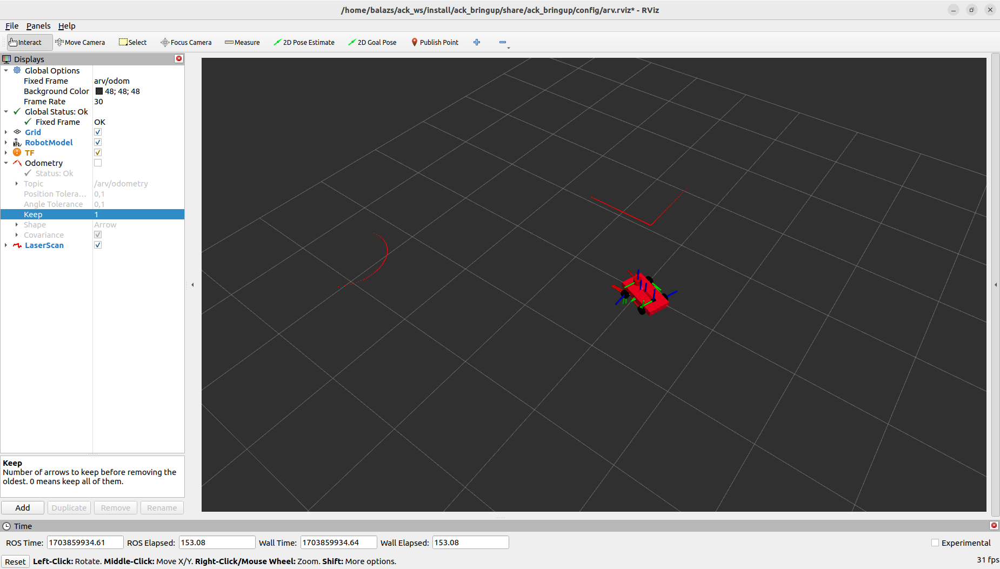
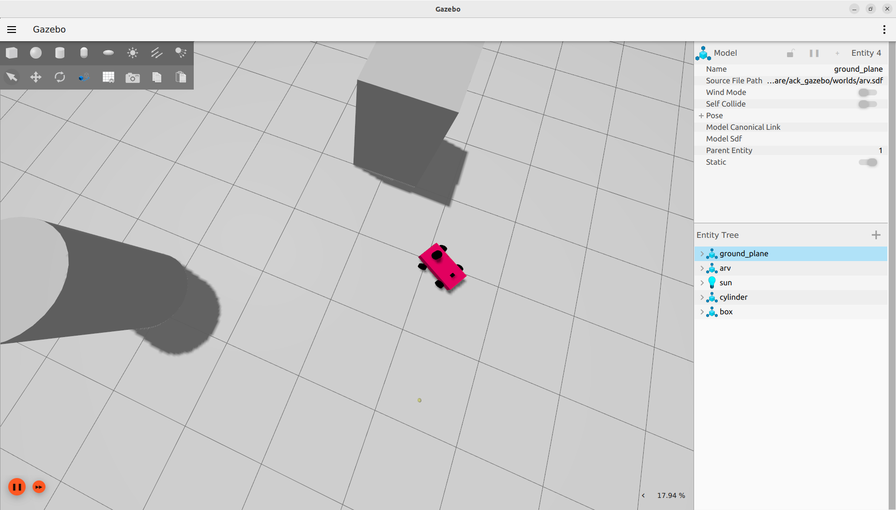

# ROS2 Autonomous Ackermann-Steering Vehicle Simulation

## Overview

Welcome to the ROS2 Humble Ackermann-Steering Car Simulation project! This repository aims to provide a straightforward simulation environment for an Ackermann-steering car using ROS2 Humble and Gazebo Fortress. The model is equipped with a LiDAR and an IMU sensors.




## The two branches

### main

This uses branch uses Gazebo for everything. Including publishing odom, simulationg sensors, and Gazebo's ackermann-steering plugin.

### ros2_control

Simulates sensors with Gazebo. Control is supported by ros2_control packages.

## Getting Started

### Prerequisites

- ROS2 Humble installed on your system. Follow the [official ROS2 installation guide](https://docs.ros.org/en/humble/Installation.html) for instructions.

- Gazebo Fortress installed. Refer to the [Gazebo documentation](https://gazebosim.org/docs/fortress/ros_installation) for installation details.

### Installation

1. Clone this repository to your src folder (or create a symlink):

    ```bash
    git clone https://github.com/BalazsPh21/ackermann_simulation.git
    ```

2. Navigate to the workspace:

    ```bash
    cd ack_ws
    ```

3. Build the project from your workspace:

    ```bash
    colcon build
    ```

4. Source the setup file:

    ```bash
    source install/setup.sh
    ```

### Running the Simulation

1. Launch the simulation environment:

    ```bash
    ros2 launch ack_bringup ack_bringup.launch.py
    ```
